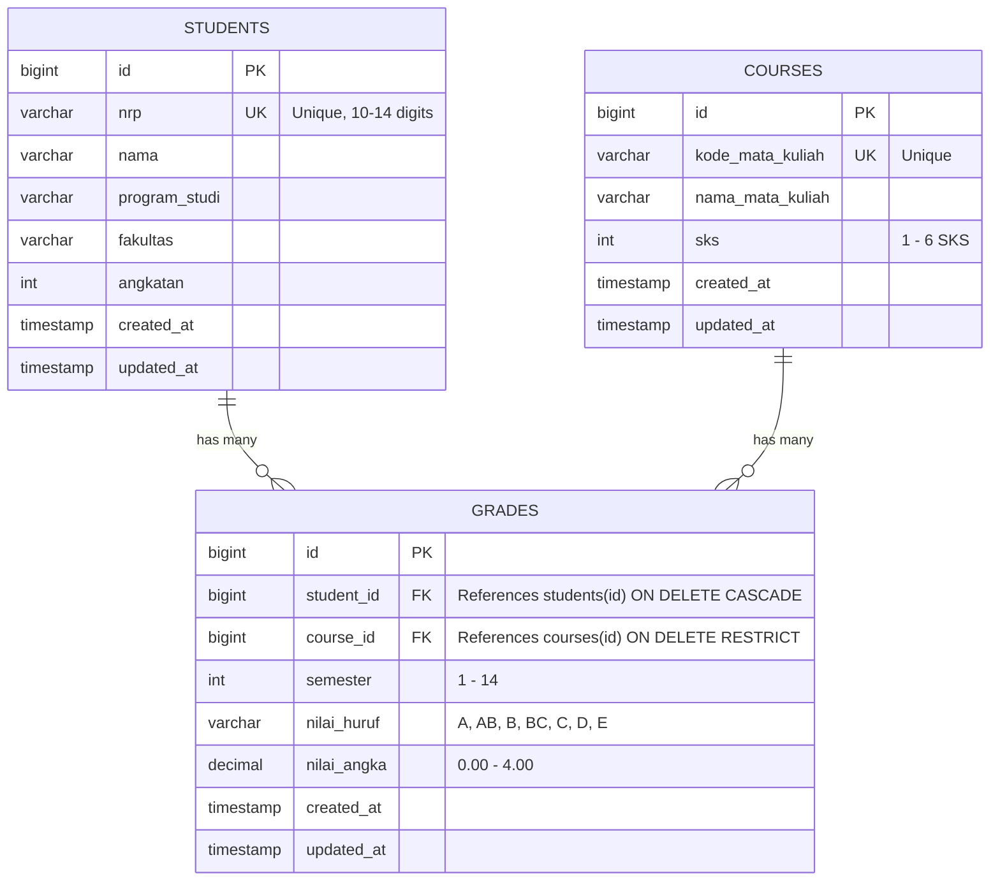

# REST API Manajemen IPK Mahasiswa ITS

REST API modern dan berkinerja tinggi menggunakan bahasa pemrograman **Go**, framework **Gin**, ORM **GORM**, dan database **PostgreSQL** untuk mengelola data mahasiswa Institut Teknologi Sepuluh Nopember (ITS), mata kuliah, nilai akademik, serta perhitungan otomatis Indeks Prestasi Semester (IP) dan Indeks Prestasi Kumulatif (IPK).

---

## 1. Nama Project
**REST API Manajemen IPK Mahasiswa ITS**  
*(Tugas Seleksi Sub-Tim Back End Web Development)*

---

## 2. Deskripsi Project
Sistem backend RESTful API yang dirancang untuk mendukung operasional akademik di lingkungan ITS. Sistem ini menangani:
- Manajemen data induk mahasiswa (NRP, nama, program studi, fakultas, angkatan) dengan validasi format NRP ITS.
- Manajemen kurikulum mata kuliah (kode MK unik, nama, bobot SKS).
- Pencatatan nilai mahasiswa per semester dengan skala konversi nilai ITS (A = 4.00 hingga E = 0.00).
- Perhitungan otomatis **IP Semester** (`GET /api/students/:id/ip/:semester`) berdasarkan rumus:
  $$\text{IP} = \frac{\sum (\text{Nilai Mutu} \times \text{SKS})}{\sum \text{SKS}}$$
- Perhitungan otomatis **IPK Kumulatif** (`GET /api/students/:id/ipk`) dengan memperhitungkan seluruh mata kuliah yang telah ditempuh serta menerapkan peraturan akademik ITS untuk pengulangan mata kuliah (mengambil nilai terbaik).

---

## 3. Tech Stack
- **Language**: [Go (Golang)](https://go.dev/) `v1.25+`
- **Web Framework**: [Gin Web Framework](https://github.com/gin-gonic/gin) (`github.com/gin-gonic/gin`)
- **ORM**: [GORM](https://gorm.io/) (`gorm.io/gorm`)
- **Database Driver**: 
  - PostgreSQL: `gorm.io/driver/postgres` (Primary)
  - SQLite: `github.com/glebarez/sqlite` (Pure Go driver untuk in-memory unit testing dan fallback zero-config)
- **Environment Management**: [godotenv](https://github.com/joho/godotenv)
- **Testing & Assertions**: [testify](https://github.com/stretchr/testify) (`assert`, `require`)
- **Version Control**: Git & GitHub

---

## 4. Fitur Utama
1. **Manajemen Mahasiswa (CRUD)**
   - `POST /api/students` - Mendaftarkan mahasiswa baru.
   - `GET /api/students` - Mendapatkan daftar seluruh mahasiswa (mendukung query filter `?search=`).
   - `GET /api/students/:id` - Mendapatkan detail mahasiswa berdasarkan ID.
   - `PUT /api/students/:id` - Memperbarui data mahasiswa.
   - `DELETE /api/students/:id` - Menghapus data mahasiswa (cascade ke data nilai).

2. **Manajemen Mata Kuliah (CRUD)**
   - `POST /api/courses` - Mendaftarkan mata kuliah baru.
   - `GET /api/courses` - Mendapatkan daftar seluruh mata kuliah.
   - `GET /api/courses/:id` - Mendapatkan detail mata kuliah berdasarkan ID.
   - `PUT /api/courses/:id` - Memperbarui data mata kuliah.
   - `DELETE /api/courses/:id` - Menghapus mata kuliah (dilindungi foreign key constraint `RESTRICT`).

3. **Manajemen Nilai (CRUD)**
   - `POST /api/grades` - Input nilai mahasiswa pada semester tertentu.
   - `GET /api/students/:id/grades` - Menampilkan riwayat seluruh nilai mahasiswa beserta relasi mata kuliah.
   - `PUT /api/grades/:id` - Memperbarui nilai huruf atau semester.
   - `DELETE /api/grades/:id` - Menghapus catatan nilai.

4. **Konversi Nilai Resmi ITS**
   Sistem mengonversi nilai huruf secara otomatis ke bobot angka:
   | Nilai Huruf | Nilai Angka / Mutu |
   |:-----------:|:------------------:|
   | **A**       | 4.00               |
   | **AB**      | 3.50               |
   | **B**       | 3.00               |
   | **BC**      | 2.50               |
   | **C**       | 2.00               |
   | **D**       | 1.00               |
   | **E**       | 0.00               |

5. **Perhitungan IP Semester**
   - `GET /api/students/:id/ip/:semester`
   - Menghitung $\text{IP} = \frac{\sum (\text{Nilai Angka} \times \text{SKS})}{\sum \text{SKS}}$ untuk semester yang diminta.
   - Mengembalikan `semester`, `total_sks`, `total_mutu`, `ip`, dan rincian mata kuliah yang diambil.

6. **Perhitungan IPK Kumulatif**
   - `GET /api/students/:id/ipk`
   - Menghitung seluruh mata kuliah yang telah diselesaikan.
   - Mengembalikan `student`, `nrp`, `nama`, `program_studi`, `total_sks`, `total_mutu`, `ipk`, dan rincian mata kuliah.

7. **Validasi & Error Handling Ketat**
   - Format NRP ITS (10-14 digit angka numerik).
   - Validasi batas SKS (1 sampai 6).
   - Validasi nilai huruf (`A`, `AB`, `B`, `BC`, `C`, `D`, `E`).
   - Validasi semester (1 sampai 14).
   - Penolakan duplikasi NRP (HTTP 409 Conflict).
   - Penolakan duplikasi input nilai mahasiswa dan mata kuliah pada semester yang sama (HTTP 409 Conflict).
   - Format response JSON yang konsisten untuk seluruh endpoint.

---

## 5. Struktur Folder Project

Penerapan **Clean Architecture** dengan pemisahan tanggung jawab (*Separation of Concerns*):

```text
rest-api-ipk-mahasiswa-its/
├── cmd/
│   └── seed/
│       └── main.go             # Script database seeder data mahasiswa, MK, & nilai
├── internal/
│   ├── config/
│   │   ├── database.go         # Konfigurasi GORM, connection pool, & auto-migration
│   │   └── env.go              # Pembaca konfigurasi environment (.env)
│   ├── handler/
│   │   ├── academic_handler.go # Controller HTTP untuk kalkulasi IP dan IPK
│   │   ├── course_handler.go   # Controller HTTP untuk CRUD Mata Kuliah
│   │   ├── grade_handler.go    # Controller HTTP untuk CRUD Nilai
│   │   ├── response.go         # Standarisasi JSON response formatter
│   │   └── student_handler.go  # Controller HTTP untuk CRUD Mahasiswa
│   ├── model/
│   │   ├── course.go           # Entity model Course & GORM tags
│   │   ├── dto.go              # DTO request, response, & kamus bobot nilai
│   │   ├── grade.go            # Entity model Grade & GORM composite unique tags
│   │   └── student.go          # Entity model Student & GORM tags
│   ├── repository/
│   │   ├── course_repository.go  # Query database PostgreSQL untuk Mata Kuliah
│   │   ├── grade_repository.go   # Query database PostgreSQL untuk Nilai (Preload)
│   │   └── student_repository.go # Query database PostgreSQL untuk Mahasiswa
│   ├── routes/
│   │   └── routes.go           # Routing Gin, middleware CORS, Logger, Recovery
│   ├── service/
│   │   ├── academic_service.go # Business logic kalkulasi IP semester & IPK kumulatif
│   │   ├── course_service.go   # Business logic & validasi data Mata Kuliah
│   │   ├── errors.go           # Domain error & mapping HTTP status code
│   │   ├── grade_service.go    # Business logic & validasi data Nilai
│   │   └── student_service.go  # Business logic & validasi data Mahasiswa
│   └── testutil/
│       └── testutil.go         # In-memory database isolator untuk unit testing
├── migrations/
│   ├── 000001_init_schema.down.sql # Script rollback DDL PostgreSQL
│   └── 000001_init_schema.up.sql   # Script inisialisasi DDL PostgreSQL
├── test/
│   └── api_integration_test.go     # End-to-end integration test seluruh endpoint
├── .env.example                # Template konfigurasi environment
├── .gitignore                  # Mengabaikan file binary, cache, OS, & kredensial
├── go.mod                      # Definisi Go module dan dependency
├── go.sum                      # Checksum verifikasi dependensi
├── main.go                     # Entrypoint aplikasi utama dengan graceful shutdown
└── README.md                   # Dokumentasi lengkap project
```

---

## 6. Database Schema & Relasi

### Entity Relationship Diagram (ERD)



### Relasi & Batasan Database:
1. **Foreign Key `student_id`**: Mengarah ke `students(id)` dengan `ON DELETE CASCADE`.
2. **Foreign Key `course_id`**: Mengarah ke `courses(id)` dengan `ON DELETE RESTRICT` (mata kuliah yang memiliki data nilai tidak dapat dihapus sembarangan).
3. **Composite Unique Index**: `idx_student_course_semester` pada kolom `(student_id, course_id, semester)` menjamin seorang mahasiswa tidak dapat memiliki dua nilai untuk mata kuliah yang sama di semester yang sama.

---

## 7. Cara Instalasi

### Prasyarat
- [Go](https://go.dev/dl/) versi 1.22 atau lebih baru (direkomendasikan Go 1.25).
- [PostgreSQL](https://www.postgresql.org/download/) versi 13 ke atas (atau PostgreSQL via Docker).
- Git.

### Langkah Instalasi
1. Clone repository ini:
   ```bash
   git clone <URL_REPOSITORY_ANDA>
   cd portodev
   ```

2. Download dan verifikasi seluruh dependency:
   ```bash
   go mod tidy
   ```

---

## 8. Cara Konfigurasi .env

Salin file `.env.example` menjadi `.env`:

```bash
cp .env.example .env
```
*(Pada Windows PowerShell gunakan `Copy-Item .env.example .env`)*

Buka `.env` dan sesuaikan kredensial PostgreSQL Anda:

```ini
# Server Configuration
SERVER_PORT=8080
GIN_MODE=debug

# Database Configuration (PostgreSQL)
DB_DRIVER=postgres
DB_HOST=localhost
DB_PORT=5432
DB_USER=postgres
DB_PASSWORD=postgres
DB_NAME=its_academic_db
DB_SSLMODE=disable
DB_TIMEZONE=Asia/Jakarta
```

> **Catatan Fleksibilitas Pengujian**:  
> Aplikasi dilengkapi fitur **Smart Fallback**. Jika Anda belum menyalakan server PostgreSQL, aplikasi akan secara aman beralih ke database SQLite lokal (`its_academic.db`), sehingga penguji/reviewer dapat langsung menjalankan `go run .` tanpa kendala koneksi database!

---

## 9. Cara Menjalankan Project

### 1. Menjalankan Server Utama
Jalankan perintah standar berikut pada root direktori:

```bash
go run .
```

Aplikasi akan melakukan:
1. Pembacaan `.env`
2. Koneksi ke database
3. Auto-migration tabel dan constraint
4. Menjalankan Gin server di port `8080`
5. Mendukung **Graceful Shutdown** via `SIGINT` (Ctrl+C).

### 2. (Opsional) Mengisi Data Contoh (Database Seeder)
Telah disediakan script seeder data mahasiswa ITS, mata kuliah, dan contoh nilai:

```bash
go run cmd/seed/main.go
```

Data yang di-seed:
- Mahasiswa: Budi Santoso (5025211001), Siti Aminah (5025211045), Ahmad Fauzi (5026211012).
- Mata Kuliah: Dasar Pemrograman, Struktur Data, PBO, Basis Data, Kalkulus 1, Bahasa Inggris.
- Nilai Semester 1 & 2 untuk simulasi IP dan IPK.

---

## 10. Daftar Endpoint

Format Standar Response:
```json
{
  "success": true,
  "message": "Deskripsi pesan",
  "data": {}
}
```

### Ringkasan Endpoint

| No | Method | Endpoint | Deskripsi |
|:---:|:---:|:---|:---|
| 1 | `GET` | `/` | Root Welcome & Versi API |
| 2 | `GET` | `/api/health` | Health Check Service |
| 3 | `POST` | `/api/students` | Tambah Mahasiswa Baru |
| 4 | `GET` | `/api/students` | Ambil Semua Mahasiswa (Filter: `?search=`) |
| 5 | `GET` | `/api/students/:id` | Ambil Detail Mahasiswa |
| 6 | `PUT` | `/api/students/:id` | Update Data Mahasiswa |
| 7 | `DELETE` | `/api/students/:id` | Hapus Mahasiswa |
| 8 | `POST` | `/api/courses` | Tambah Mata Kuliah Baru |
| 9 | `GET` | `/api/courses` | Ambil Semua Mata Kuliah |
| 10 | `GET` | `/api/courses/:id` | Ambil Detail Mata Kuliah |
| 11 | `PUT` | `/api/courses/:id` | Update Mata Kuliah |
| 12 | `DELETE` | `/api/courses/:id` | Hapus Mata Kuliah |
| 13 | `POST` | `/api/grades` | Input Nilai Mahasiswa |
| 14 | `GET` | `/api/students/:id/grades` | Ambil Riwayat Nilai Mahasiswa |
| 15 | `PUT` | `/api/grades/:id` | Update Nilai / Semester |
| 16 | `DELETE` | `/api/grades/:id` | Hapus Catatan Nilai |
| 17 | `GET` | `/api/students/:id/ip/:semester` | **Hitung IP Semester Mahasiswa** |
| 18 | `GET` | `/api/students/:id/ipk` | **Hitung IPK Kumulatif Mahasiswa** |

---

## 11. Contoh Request & Response

### A. Tambah Mahasiswa
- **URL**: `POST /api/students`
- **Request Body**:
  ```json
  {
    "nrp": "5025211001",
    "nama": "Budi Santoso",
    "program_studi": "Teknik Informatika",
    "fakultas": "FTEIC",
    "angkatan": 2021
  }
  ```
- **Response (201 Created)**:
  ```json
  {
    "success": true,
    "message": "Student created successfully",
    "data": {
      "id": 1,
      "nrp": "5025211001",
      "nama": "Budi Santoso",
      "program_studi": "Teknik Informatika",
      "fakultas": "FTEIC",
      "angkatan": 2021,
      "created_at": "2026-09-26T23:44:28+07:00",
      "updated_at": "2026-09-26T23:44:28+07:00"
    }
  }
  ```

### B. Tambah Mata Kuliah
- **URL**: `POST /api/courses`
- **Request Body**:
  ```json
  {
    "kode_mata_kuliah": "IF184101",
    "nama_mata_kuliah": "Dasar Pemrograman",
    "sks": 3
  }
  ```
- **Response (201 Created)**:
  ```json
  {
    "success": true,
    "message": "Course created successfully",
    "data": {
      "id": 1,
      "kode_mata_kuliah": "IF184101",
      "nama_mata_kuliah": "Dasar Pemrograman",
      "sks": 3,
      "created_at": "2026-09-26T23:44:28+07:00",
      "updated_at": "2026-09-26T23:44:28+07:00"
    }
  }
  ```

### C. Input Nilai Mahasiswa
- **URL**: `POST /api/grades`
- **Request Body**:
  ```json
  {
    "student_id": 1,
    "course_id": 1,
    "semester": 1,
    "nilai_huruf": "A"
  }
  ```
- **Response (201 Created)**:
  ```json
  {
    "success": true,
    "message": "Grade created successfully",
    "data": {
      "id": 1,
      "student_id": 1,
      "course_id": 1,
      "semester": 1,
      "nilai_huruf": "A",
      "nilai_angka": 4,
      "created_at": "2026-09-26T23:44:28+07:00",
      "updated_at": "2026-09-26T23:44:28+07:00"
    }
  }
  ```

### D. Perhitungan IP Semester
- **URL**: `GET /api/students/1/ip/1`
- **Response (200 OK)**:
  ```json
  {
    "success": true,
    "message": "IP Semester 1 calculated successfully",
    "data": {
      "student_id": 1,
      "nrp": "5025211001",
      "nama": "Budi Santoso",
      "semester": 1,
      "total_sks": 8,
      "total_mutu": 30.5,
      "ip": 3.81,
      "courses": [
        {
          "id": 1,
          "course_id": 1,
          "kode_mata_kuliah": "IF184101",
          "nama_mata_kuliah": "Dasar Pemrograman",
          "sks": 3,
          "semester": 1,
          "nilai_huruf": "A",
          "nilai_angka": 4,
          "nilai_mutu": 12
        },
        {
          "id": 2,
          "course_id": 5,
          "kode_mata_kuliah": "KM184101",
          "nama_mata_kuliah": "Kalkulus 1",
          "sks": 3,
          "semester": 1,
          "nilai_huruf": "AB",
          "nilai_angka": 3.5,
          "nilai_mutu": 10.5
        },
        {
          "id": 3,
          "course_id": 6,
          "kode_mata_kuliah": "UG184914",
          "nama_mata_kuliah": "Bahasa Inggris",
          "sks": 2,
          "semester": 1,
          "nilai_huruf": "A",
          "nilai_angka": 4,
          "nilai_mutu": 8
        }
      ]
    }
  }
  ```

### E. Perhitungan IPK Kumulatif
- **URL**: `GET /api/students/1/ipk`
- **Response (200 OK)**:
  ```json
  {
    "success": true,
    "message": "IPK calculated successfully",
    "data": {
      "student_id": 1,
      "student": "5025211001 - Budi Santoso",
      "nrp": "5025211001",
      "nama": "Budi Santoso",
      "program_studi": "Teknik Informatika",
      "fakultas": "FTEIC",
      "angkatan": 2021,
      "total_sks": 18,
      "total_mutu": 65.5,
      "ipk": 3.64,
      "total_mata_kuliah": 6,
      "courses": [
        {
          "id": 1,
          "course_id": 1,
          "kode_mata_kuliah": "IF184101",
          "nama_mata_kuliah": "Dasar Pemrograman",
          "sks": 3,
          "semester": 1,
          "nilai_huruf": "A",
          "nilai_angka": 4,
          "nilai_mutu": 12
        },
        {
          "id": 4,
          "course_id": 2,
          "kode_mata_kuliah": "IF184201",
          "nama_mata_kuliah": "Struktur Data",
          "sks": 3,
          "semester": 2,
          "nilai_huruf": "A",
          "nilai_angka": 4,
          "nilai_mutu": 12
        }
      ]
    }
  }
  ```

### F. Contoh Respon Error
- **NRP Duplikat (409 Conflict)**:
  ```json
  {
    "success": false,
    "message": "Student with NRP '5025211001' already exists",
    "data": null
  }
  ```

- **Nilai Duplikat pada Semester yang Sama (409 Conflict)**:
  ```json
  {
    "success": false,
    "message": "Grade for student ID 1, course ID 1, in semester 1 already exists",
    "data": null
  }
  ```

- **Data Tidak Ditemukan (404 Not Found)**:
  ```json
  {
    "success": false,
    "message": "Student with ID 999 not found",
    "data": null
  }
  ```

- **Validasi Gagal (400 Bad Request)**:
  ```json
  {
    "success": false,
    "message": "NRP must consist of 10 to 14 numeric digits (ITS standard format)",
    "data": null
  }
  ```

---

## 12. Cara Testing API

### A. Menggunakan cURL

```bash
# 1. Health check
curl -X GET http://localhost:8080/api/health

# 2. Daftar Mahasiswa
curl -X GET http://localhost:8080/api/students

# 3. Hitung IP Semester 1 Mahasiswa ID 1
curl -X GET http://localhost:8080/api/students/1/ip/1

# 4. Hitung IPK Mahasiswa ID 1
curl -X GET http://localhost:8080/api/students/1/ipk
```

### B. Menjalankan Automated Test Suite (Unit & Integration Test)

Aplikasi memiliki pengujian komprehensif mencakup validasi model, service, dan HTTP endpoint end-to-end:

```bash
go test ./... -v
```

Hasil test suite:
```text
=== RUN   TestGradeConversion
--- PASS: TestGradeConversion (0.00s)
=== RUN   TestAcademicService_CalculateIPSemester
--- PASS: TestAcademicService_CalculateIPSemester (0.00s)
=== RUN   TestAcademicService_CalculateIPK
--- PASS: TestAcademicService_CalculateIPK (0.00s)
=== RUN   TestCourseService_CRUD
--- PASS: TestCourseService_CRUD (0.00s)
=== RUN   TestGradeService_CRUD
--- PASS: TestGradeService_CRUD (0.00s)
=== RUN   TestStudentService_CRUD
--- PASS: TestStudentService_CRUD (0.00s)
=== RUN   TestAPI_EndToEndFlow
--- PASS: TestAPI_EndToEndFlow (0.01s)
PASS
ok      rest-api-ipk-mahasiswa-its/internal/service     0.130s
ok      rest-api-ipk-mahasiswa-its/test                 0.144s
```

---

## 13. Contoh Alur Perhitungan IPK

Berikut contoh alur perhitungan IPK mahasiswa:

### Semester 1
| Mata Kuliah | SKS | Nilai Huruf | Bobot Nilai | Nilai Mutu ($\text{SKS} \times \text{Bobot}$) |
|:---|:---:|:---:|:---:|:---:|
| Dasar Pemrograman | 3 | A | 4.00 | $3 \times 4.00 = 12.0$ |
| Kalkulus 1 | 3 | AB | 3.50 | $3 \times 3.50 = 10.5$ |
| Bahasa Inggris | 2 | A | 4.00 | $2 \times 4.00 = 8.0$ |
| **Total** | **8** | - | - | **30.5** |

$$\text{IP Semester 1} = \frac{30.5}{8} = 3.8125 \approx \mathbf{3.81}$$

### Semester 2
| Mata Kuliah | SKS | Nilai Huruf | Bobot Nilai | Nilai Mutu ($\text{SKS} \times \text{Bobot}$) |
|:---|:---:|:---:|:---:|:---:|
| Struktur Data | 3 | A | 4.00 | $3 \times 4.00 = 12.0$ |
| PBO | 3 | B | 3.00 | $3 \times 3.00 = 9.0$ |
| Basis Data | 4 | AB | 3.50 | $4 \times 3.50 = 14.0$ |
| **Total** | **10** | - | - | **35.0** |

$$\text{IP Semester 2} = \frac{35.0}{10} = \mathbf{3.50}$$

### Perhitungan IPK Kumulatif (Semester 1 & 2):
$$\text{Total SKS Kumulatif} = 8 + 10 = \mathbf{18}$$
$$\text{Total Mutu Kumulatif} = 30.5 + 35.0 = \mathbf{65.5}$$
$$\text{IPK} = \frac{\sum \text{Mutu Kumulatif}}{\sum \text{SKS Kumulatif}} = \frac{65.5}{18} = 3.6388 \approx \mathbf{3.64}$$
